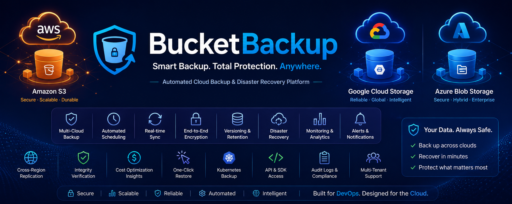
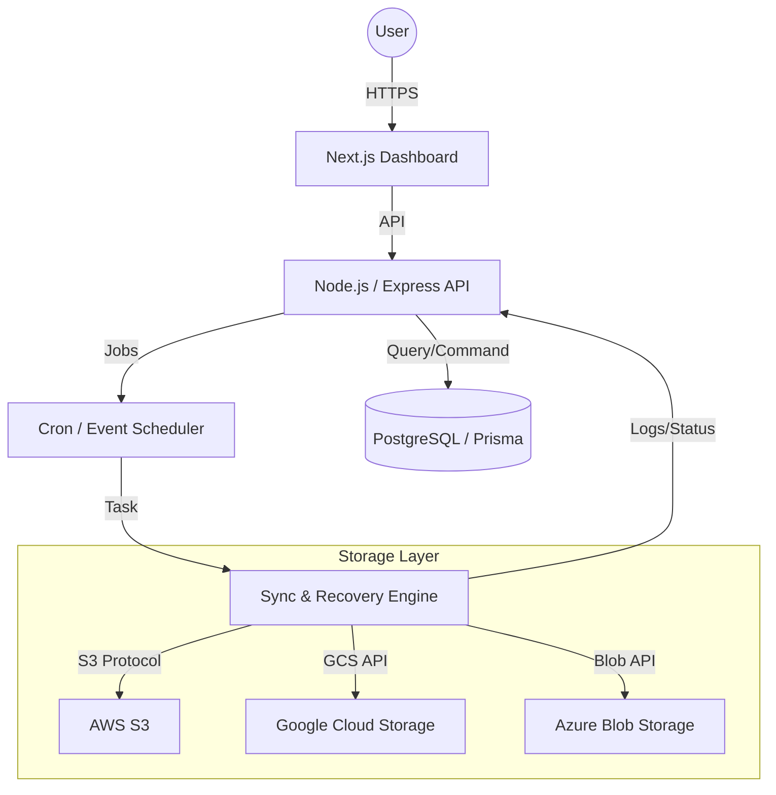

<div align="center">
  
  # ☁️ BucketBackup
  ### **Enterprise-Grade Multi-Cloud Backup & Disaster Recovery**

  [](https://nextjs.org/)
  [](https://nodejs.org/)
  [](https://www.terraform.io/)
  [](https://kubernetes.io/)
  [](https://opensource.org/licenses/MIT)

  

  **BucketBackup** is a high-performance, intelligent orchestration platform designed to secure and synchronize your data across the world's leading cloud storage providers. Built for reliability, it ensures your enterprise data is always protected, versioned, and recoverable.

</div>

---

## 🌟 Key Capabilities

BucketBackup isn't just a sync tool; it's a complete data management ecosystem.

- 🛡️ **Multi-Cloud Synergy**: Seamlessly bridge **AWS S3**, **Google Cloud Storage**, and **Azure Blob Storage**.
- ⚡ **Real-Time Sync**: High-concurrency engine for instantaneous data replication.
- 🤖 **AI-Powered Monitoring**: Integrated anomaly detection to identify potential data corruption or security threats.
- 🔄 **One-Click Recovery**: Intuitive disaster recovery workflows to restore business continuity in minutes.
- 🔐 **Zero-Trust Security**: End-to-end AES-256 encryption with granular Role-Based Access Control (RBAC).
- 📊 **Live Analytics**: A stunning executive dashboard providing real-time visibility into your global storage footprint.

---

## 🏗️ System Architecture

BucketBackup uses a decoupled, microservices-ready architecture designed for horizontal scalability.



---

## 🛠️ Technology Stack

| Layer | Technology | Purpose |
| :--- | :--- | :--- |
| **Frontend** | Next.js 14, Tailwind CSS, Lucide Icons | Modern, responsive dashboard UI |
| **Backend** | Node.js, TypeScript, Express | High-performance API and business logic |
| **Database** | PostgreSQL, Prisma ORM | Relational data and schema management |
| **Infrastructure** | Terraform, HCL | Multi-cloud resource provisioning |
| **Orchestration** | Kubernetes, Docker, Helm | Containerized deployment and scaling |
| **Cloud** | AWS, GCP, Azure | Distributed object storage providers |

---

## 🚀 Getting Started

### 📋 Prerequisites

Before you begin, ensure you have the following installed:
- **Node.js (v20+)** and **npm/pnpm**
- **Docker** & **Kubernetes** (for deployment)
- **Terraform** (for cloud provisioning)
- **Cloud Accounts**: Active subscriptions for AWS, GCP, and Azure.

### ⚙️ Quick Installation

1. **Clone the Repository**
   ```bash
   git clone https://github.com/Pranav-Saraswat/BucketBackup.git
   cd BucketBackup
   ```

2. **Provision Infrastructure**
   ```bash
   cd terraform
   terraform init
   terraform apply -auto-approve
   ```

3. **Initialize the Backend**
   ```bash
   cd ../server
   npm install
   cp .env.example .env # Configure your keys here
   npx prisma generate
   npm run dev
   ```

4. **Launch the Dashboard**
   ```bash
   cd ../client
   npm install
   npm run dev
   ```

Visit **`http://localhost:3000`** to start managing your buckets.

---

## 🐳 Deployment (Cloud-Native)

BucketBackup is designed to run anywhere. Use our pre-configured manifests for a production-ready Kubernetes setup.

**Build the Containers:**
```bash
docker build -t bucketbackup-server ./server
docker build -t bucketbackup-client ./client
```

**Deploy to Cluster:**
```bash
kubectl apply -f k8s/
```

---

## 🛡️ Security & Compliance

We prioritize the integrity of your data above all else.

*   **Encryption at Rest**: All storage buckets are configured with SSE (Server-Side Encryption).
*   **Encryption in Transit**: TLS 1.3 enforced for all data movement.
*   **Auditability**: Complete logging of every file operation and administrative action.
*   **Integrity Checks**: Automated MD5/SHA-256 checksums verify data consistency after every sync.

---

## 🗺️ Roadmap

- [ ] **v1.5**: Support for On-Premise S3 (MinIO).
- [ ] **v1.8**: Deep Learning models for Predictive Storage Cost Optimization.
- [ ] **v2.0**: Blockchain-based immutable audit logs.

---

## 🤝 Contributing

Contributions make the open-source community an amazing place to learn, inspire, and create. Any contributions you make are **greatly appreciated**.

1. Fork the Project
2. Create your Feature Branch (`git checkout -b feature/AmazingFeature`)
3. Commit your Changes (`git commit -m 'Add some AmazingFeature'`)
4. Push to the Branch (`git push origin feature/AmazingFeature`)
5. Open a Pull Request

---

## 📜 License

Distributed under the MIT License. See `LICENSE` for more information.

---

<div align="center">
  Built with ❤️ by <b>Pranav Saraswat</b><br/>
  <i>Empowering enterprises with intelligent cloud recovery.</i>

  [Report Bug](https://github.com/Pranav-Saraswat/BucketBackup/issues) · [Request Feature](https://github.com/Pranav-Saraswat/BucketBackup/issues)
</div>
